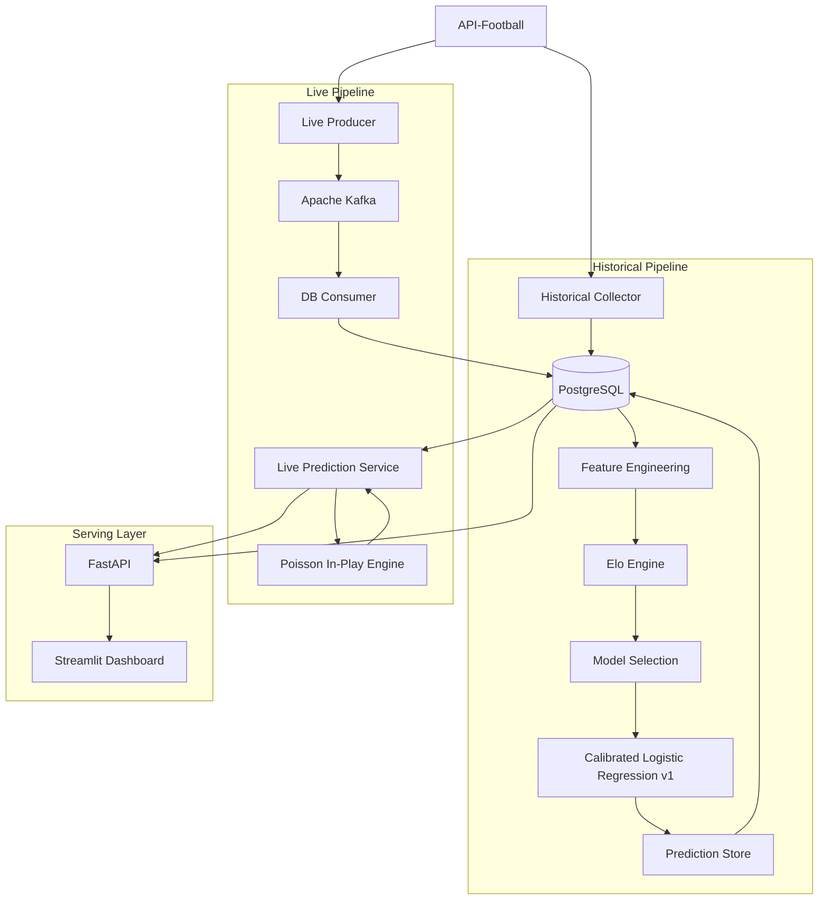

# ⚽ AI Football Intelligence Platform

An end-to-end football data engineering and machine learning platform for Premier League match probabilities, including historical data ingestion, leakage-safe feature engineering, calibrated pre-match predictions, event streaming with Kafka, dynamic in-play probabilities, a REST API, and a live dashboard.

The project was built primarily as a Data Engineering and ML learning project, with emphasis on architecture, reproducibility, chronological evaluation, and production-oriented design.

---

## Current Version

**v0.1**

The current MVP supports:

- Historical Premier League and Championship data ingestion
- PostgreSQL persistence
- Leakage-safe feature engineering
- Elo-based team strength modeling
- Chronological model selection and calibration
- Frozen pre-match prediction storage
- Kafka-based live match event streaming
- PostgreSQL live-state persistence
- Dynamic in-play probabilities
- FastAPI REST endpoints
- Streamlit live dashboard
- Replay mode for demonstrating live probability changes
- Final untouched 2026 holdout evaluation

---

## Architecture



The historical and live paths share PostgreSQL as the persistent source of truth, while Kafka decouples live data ingestion from downstream processing.

---

## Data Pipeline

Historical fixtures are collected from API-Football for Premier League and Championship seasons from 2020 onward.

Premier League data is used for the prediction model. Championship data provides supporting context for promoted and relegated teams in the Elo system.

Historical processing follows:

```text
API-Football
    ↓
Historical ingestion
    ↓
PostgreSQL
    ↓
Team-perspective match history
    ↓
Leakage-safe rolling features
    ↓
Elo ratings
    ↓
Chronological ML evaluation
```

Rolling features are shifted before calculation so the current match result can never leak into its own prediction.

---

## Model v1

The final pre-match model is:

```text
Multiclass Logistic Regression
Feature: pre-match Elo difference
Output: Home / Draw / Away probabilities
Calibration: Sigmoid
```

Several feature groups were evaluated during model selection, including recent form, goals, shots on target, venue-specific form, squad value, and XGBoost models.

For v1, the Elo-only Logistic Regression generalized better under expanding walk-forward validation than the more complex feature sets.

The goal was therefore not to maximize model complexity, but to select the simplest model supported by chronological out-of-sample evidence.

---

## Chronological Evaluation Strategy

Football is time-dependent, so random train/test splitting was intentionally avoided.

The final model protocol is:

| Period | Purpose |
|---|---|
| 2020 | Historical warm-up / Elo context |
| 2021–2024 | Base model training |
| 2025 | Probability calibration |
| 2026 | Final untouched holdout |

The 2026 holdout was opened only after model selection, calibration, and the final model architecture were frozen.

### Final v1 Holdout

The final one-time evaluation used **50 previously untouched Premier League matches from 2026**.

| Metric | Result |
|---|---:|
| Log Loss | **1.0533** |
| Accuracy | **46.00%** |
| Multiclass Brier Score | **0.6342** |

For reference, uniform 1/3 probabilities produce a Log Loss of approximately `1.0986`.

The holdout results were not used to tune model v1.

---

## Pre-Match Prediction Store

Predictions are materialized before matches in the PostgreSQL table:

```text
fixture_predictions
```

Each prediction stores:

```text
fixture_id
model_version
home_elo
away_elo
elo_diff
prob_home
prob_draw
prob_away
```

The primary key is:

```text
(fixture_id, model_version)
```

Predictions are immutable for the same model version, preventing live processing from accidentally recalculating the pre-match baseline.

---

## Live Event Streaming

Live match updates follow:

```text
API-Football
    ↓
Live Producer
    ↓
Kafka topic: live_match_updates
    ↓
DB Consumer
    ↓
PostgreSQL
```

Kafka runs locally in Docker using KRaft mode.

The consumer uses manual offset commits:

```text
event received
    ↓
validate event
    ↓
write PostgreSQL transaction
    ↓
commit Kafka offset
```

This provides at-least-once delivery semantics.

Database writes are designed to be idempotent so replayed events do not create duplicate snapshots.

---

## Dynamic In-Play Probabilities

The live model intentionally does not pretend to be a separately trained live ML model because historical minute-by-minute training snapshots are not yet available.

Instead, v0.1 uses a mathematically defined Poisson approach.

The frozen pre-match Home / Draw / Away probabilities are converted into expected full-match goal rates:

```text
pre-match probabilities
        ↓
fit λ_home and λ_away
        ↓
current minute
        ↓
remaining expected goals
        ↓
current score
        ↓
new Home / Draw / Away probabilities
```

For example, a pre-match home probability of roughly 63% can move above 85% when the home team leads 1–0 during the match.

The current live engine uses only:

```text
pre-match probabilities
current minute
current score
```

Live shots, xG, red cards, and other match-state features are intentionally left for a future version that can be trained on historical live snapshots.

---

## REST API

FastAPI exposes the prediction system through HTTP.

Main endpoints:

| Endpoint | Purpose |
|---|---|
| `GET /health` | Service health check |
| `GET /predictions/upcoming` | Stored pre-match predictions |
| `GET /predictions/live` | All currently live predictions |
| `GET /predictions/live/{fixture_id}` | Live prediction for one fixture |

Interactive API documentation is available locally at:

```text
http://127.0.0.1:8000/docs
```

---

## Dashboard

The Streamlit dashboard communicates only with FastAPI.

It does not connect directly to PostgreSQL and does not load the ML model itself.

```text
Browser
   ↓
Streamlit
   ↓ HTTP
FastAPI
   ↓
Prediction services
   ↓
PostgreSQL
```

Live matches refresh every 5 seconds.

The dashboard displays:

```text
current score
match minute
live probabilities
change vs pre-match probability
upcoming pre-match predictions
```

---

## Live Replay Demo

The project includes a replay utility:

```bash
python -m streaming.demo_live_replay
```

It sends synthetic match states through the real Kafka pipeline.

Example sequence:

```text
1'   0-0
20'  0-0
30'  1-0
55'  1-0
70'  1-1
82'  2-1
```

The events are not injected directly into the dashboard.

They travel through:

```text
Replay
→ Kafka
→ DB Consumer
→ PostgreSQL
→ In-play engine
→ FastAPI
→ Streamlit
```

This makes the replay useful as an end-to-end system demonstration rather than a UI-only simulation.

---

## Technology Stack

| Layer | Technology |
|---|---|
| Language | Python |
| Data processing | Pandas / NumPy |
| Database | PostgreSQL / psycopg |
| ML | scikit-learn / XGBoost |
| Statistical modeling | SciPy |
| Streaming | Apache Kafka |
| Kafka client | confluent-kafka |
| Containerization | Docker / Docker Compose |
| API | FastAPI / Uvicorn |
| Dashboard | Streamlit |
| Data source | API-Football |

---

## Project Structure

```text
sports-ai-platform/
│
├── api/
│   └── main.py
│
├── collector/
│   └── fetch_matches.py
│
├── dashboard/
│   └── app.py
│
├── database/
│   ├── connection.py
│   ├── queries.py
│   └── schema.sql
│
├── features/
│   ├── elo.py
│   └── rolling_feature.py
│
├── modeling/
│   ├── dataset_split.py
│   ├── final_elo_model.py
│   ├── final_holdout_evaluation.py
│   ├── in_play_probability.py
│   ├── live_prediction.py
│   ├── predict_upcoming_fixtures.py
│   └── store_upcoming_predictions.py
│
├── streaming/
│   ├── kafka_producer.py
│   ├── kafka_consumer.py
│   ├── live_kafka_producer.py
│   ├── db_consumer.py
│   ├── demo_live_event.py
│   └── demo_live_replay.py
│
├── docker-compose.yml
├── requirements.txt
└── README.md
```

---

## Local Setup

Clone the repository and create a virtual environment:

```bash
git clone <repository-url>
cd sports-ai-platform

python -m venv .venv
```

Activate it on Windows:

```powershell
.\.venv\Scripts\Activate.ps1
```

Install dependencies:

```bash
python -m pip install -r requirements.txt
```

Copy:

```text
.env.example
```

to:

```text
.env
```

and provide the PostgreSQL credentials and API-Football API key.

Create the PostgreSQL schema using:

```text
database/schema.sql
```

Then collect historical data:

```bash
python -m collector.fetch_matches
```

Train and save model v1:

```bash
python -m modeling.final_elo_model
```

Store upcoming predictions:

```bash
python -m modeling.store_upcoming_predictions
```

---

## Running the Live System

Start Kafka:

```bash
docker compose up -d
```

Create the topic if necessary:

```bash
docker exec broker /opt/kafka/bin/kafka-topics.sh --bootstrap-server localhost:9092 --create --if-not-exists --topic live_match_updates --partitions 1 --replication-factor 1
```

Start the database consumer in a separate terminal:

```bash
python -m streaming.db_consumer
```

Start FastAPI:

```bash
python -m uvicorn api.main:app --reload
```

Start the dashboard:

```bash
python -m streamlit run dashboard/app.py
```

The dashboard will normally be available at:

```text
http://localhost:8501
```

For real Premier League live updates, run:

```bash
python -m streaming.live_kafka_producer
```

The producer continuously polls API-Football and publishes current Premier League match states to Kafka.

For an offline demonstration, use:

```bash
python -m streaming.demo_live_replay
```

---

## Final Holdout Evaluation

The frozen v1 evaluation can be reproduced against the original 50-match holdout snapshot with:

```bash
python -m modeling.final_holdout_evaluation
```

The evaluation script intentionally checks for exactly 50 holdout rows.

This protects the original v1 evaluation from silently changing as additional 2026 fixtures are later ingested.

---

## Modeling Principles

The project follows several constraints intentionally:

```text
No random temporal train/test split
No bookmaker odds as model features
No API-Football prediction product as model input
No holdout-driven tuning
No fake live ML model without historical live training data
No unnecessary distributed infrastructure purely for complexity
```

Bookmaker data, if added later, will be used only as an independent benchmark after model predictions are generated.

---

## Future Work

Potential next versions include live match features such as xG, shots, red cards and possession; historical live-snapshot collection; bookmaker benchmarking; richer calibration diagnostics; additional leagues; cloud deployment; public dashboard hosting; and automated orchestration.

---

## Project Goal

The main goal of the project is not to claim state-of-the-art football forecasting performance.

It is to demonstrate an end-to-end data and ML system where data ingestion, temporal feature engineering, model evaluation, event streaming, persistence, inference, APIs, and presentation are connected in a coherent and reproducible architecture.