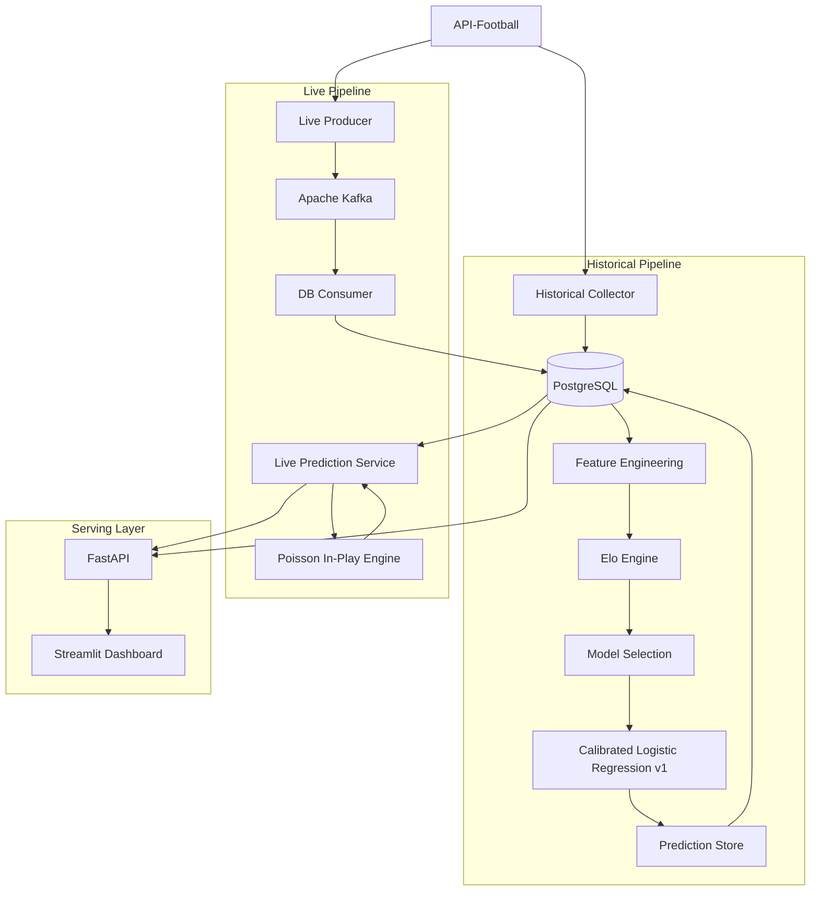

# ⚽ AI Football Intelligence Platform

An end-to-end football data engineering and machine learning platform for Premier League match probabilities.

The system combines historical data ingestion, PostgreSQL persistence, leakage-safe feature engineering, chronological machine learning evaluation, calibrated pre-match probabilities, Kafka-based event streaming, dynamic in-play probabilities, a REST API, and an interactive Streamlit dashboard.

The project was built primarily as a **Data Engineering and Machine Learning learning project**, with an emphasis on architecture, reproducibility, temporal correctness, system integration, and production-oriented design.

---

## 🌐 Live Demo

### Public Dashboard

https://sports-ai-platform-lrlt8thjdlf2q4cwnqnbdy.streamlit.app/

### Public REST API

https://sports-ai-platform.onrender.com

### Interactive API Documentation

https://sports-ai-platform.onrender.com/docs

> The public deployment currently serves cloud-hosted pre-match predictions.
>
> The complete Kafka-based real-time ingestion pipeline is implemented and tested end-to-end locally. It can be demonstrated using the included live replay workflow.

The API is hosted on a free Render instance, so the first request after a period of inactivity may take longer while the service starts.

---

## Current Version

**v0.1 — MVP**

The current system supports:

- Historical Premier League and Championship data ingestion
- PostgreSQL persistence
- Leakage-safe feature engineering
- Elo-based team strength modeling
- Chronological model selection and evaluation
- Probability calibration
- Frozen pre-match prediction storage
- Kafka-based live match event streaming
- PostgreSQL live-state persistence
- Dynamic in-play probabilities
- FastAPI REST endpoints
- Streamlit dashboard
- Public cloud deployment
- Replay mode for live probability demonstrations
- Final untouched 2026 holdout evaluation

---

# Architecture



The historical and live paths share PostgreSQL as the persistent source of truth.

Kafka decouples live event ingestion from downstream persistence and inference.

---

# Cloud Deployment

The public showcase uses a separated presentation, API, and persistence architecture:

```text
Public User
    ↓
Streamlit Community Cloud
    ↓ HTTPS
Render FastAPI
    ↓
Neon PostgreSQL
```

The dashboard does **not** connect directly to PostgreSQL.

Instead:

```text
Streamlit
    ↓ HTTP
FastAPI
    ↓ SQL
PostgreSQL
```

This keeps the presentation layer separated from the persistence layer and makes FastAPI the service boundary between the UI and the backend.

## Public vs Local Live Infrastructure

The public deployment currently serves the cloud-hosted prediction store.

The complete real-time event pipeline remains part of the local system:

```text
API-Football
    ↓
Live Producer
    ↓
Apache Kafka
    ↓
DB Consumer
    ↓
PostgreSQL
    ↓
In-Play Probability Engine
    ↓
FastAPI
    ↓
Streamlit
```

The live pipeline has been tested end-to-end using both real API polling and the included replay utility.

The streaming components can later be moved to cloud infrastructure without changing the core FastAPI prediction interface.

---

# Historical Data Pipeline

Historical fixtures are collected from API-Football for Premier League and Championship seasons from 2020 onward.

The Premier League is the primary modeling league.

Championship data is used as supporting context for promoted and relegated teams in the Elo system.

The historical processing flow is:

```text
API-Football
    ↓
Historical ingestion
    ↓
PostgreSQL
    ↓
Team-perspective match history
    ↓
Leakage-safe rolling features
    ↓
Elo ratings
    ↓
Chronological ML evaluation
```

Rolling features are shifted before calculation so that information from the current fixture can never leak into its own prediction.

---

# Elo Rating System

The Elo system provides a continuously updated estimate of team strength.

Each fixture uses the ratings that existed **before the match**.

The system includes:

- Initial team rating
- Match-based Elo updates
- Home advantage
- Promotion and relegation adjustments
- Cross-league strength calibration

The selected v1 parameters include:

```text
K factor: 20
Home advantage: 40 Elo points
Premier League / Championship gap: 250 Elo points
```

The Elo implementation is chronological and leakage-safe.

---

# Feature Engineering

The project includes rolling historical features such as:

- Last 5 match points per game
- Last 10 match points per game
- Goals scored averages
- Goals conceded averages
- Shots on target averages
- Home-specific form
- Away-specific form
- Historical availability counters
- Squad value
- Elo difference

Early-season and newly promoted-team missing values are treated as genuine lack of historical information rather than automatically being replaced with zero.

All feature engineering respects fixture chronology.

---

# Model Selection

Several model and feature configurations were compared using expanding walk-forward validation.

Models evaluated included:

- Multiclass Logistic Regression
- XGBoost

Feature configurations included:

- Elo only
- Rolling form
- Goals scored and conceded
- Shots on target
- Venue-specific form
- Squad value
- Combined feature sets

More complex models and feature groups did not consistently improve chronological out-of-sample Log Loss.

The final v1 model was therefore selected based on generalization rather than complexity.

---

# Model v1

The final pre-match model is:

```text
Multiclass Logistic Regression
Feature: pre-match Elo difference
Output: Home / Draw / Away probabilities
Calibration: Sigmoid
```

The model produces three probabilities:

```text
P(Home win)
P(Draw)
P(Away win)
```

These probabilities always form a complete match outcome distribution.

Bookmaker odds and API-Football prediction products are **not** used as model inputs.

---

# Chronological Evaluation Strategy

Football data is inherently temporal.

Random train/test splitting was intentionally avoided.

The final evaluation protocol is:

| Period | Purpose |
|---|---|
| 2020 | Historical warm-up / Elo context |
| 2021–2024 | Base model training |
| 2025 | Probability calibration |
| 2026 | Final holdout |

The 2026 holdout was opened only after model selection, calibration, and the final v1 architecture had been frozen.

---

## Walk-Forward Validation

The model-selection process used expanding chronological folds.

Example structure:

```text
Fold 1:
Train → 2021
Validate → 2022

Fold 2:
Train → 2021–2022
Validate → 2023

Fold 3:
Train → 2021–2023
Validate → 2024
```

The Elo-only Logistic Regression achieved a mean validation Log Loss of approximately:

```text
0.9700
```

This was the strongest generalizing configuration among the tested v1 candidates.

---

# Final v1 Holdout

The final one-time holdout evaluation used:

```text
50 previously untouched Premier League matches from 2026
```

Results:

| Metric | Result |
|---|---:|
| Log Loss | **1.0533** |
| Accuracy | **46.00%** |
| Multiclass Brier Score | **0.6342** |

For reference, uniform probabilities:

```text
Home = 1/3
Draw = 1/3
Away = 1/3
```

produce a Log Loss of approximately:

```text
1.0986
```

The holdout results were not used to tune model v1.

After this evaluation, those 50 fixtures were considered exposed and are no longer treated as a pristine future model-selection set.

---

# Pre-Match Prediction Store

Predictions are materialized before fixtures in the PostgreSQL table:

```text
fixture_predictions
```

Each prediction stores:

```text
fixture_id
model_version
created_at
home_elo
away_elo
elo_diff
prob_home
prob_draw
prob_away
```

The primary key is:

```text
(fixture_id, model_version)
```

Predictions are immutable for a given model version.

This prevents live processing from accidentally recalculating or modifying the original pre-match probability baseline.

---

# Live Event Streaming

Live match updates follow:

```text
API-Football
    ↓
Live Producer
    ↓
Kafka topic: live_match_updates
    ↓
DB Consumer
    ↓
PostgreSQL
```

Kafka runs locally in Docker using **KRaft mode**, without ZooKeeper.

The topic currently uses:

```text
Topic: live_match_updates
Partitions: 1
Replication Factor: 1
```

The live producer continuously polls API-Football and filters Premier League fixtures before publishing events.

The polling interval can be configured through:

```text
LIVE_POLL_INTERVAL_SECONDS
```

with a default of 60 seconds.

---

# Kafka Consumer Semantics

The PostgreSQL consumer uses manual Kafka offset commits.

The processing order is:

```text
Receive event
    ↓
Validate event
    ↓
Write PostgreSQL transaction
    ↓
Commit transaction
    ↓
Commit Kafka offset
```

This provides **at-least-once delivery semantics**.

Because a message can theoretically be replayed, database writes are designed to be idempotent.

This means duplicate event delivery does not create duplicate snapshots.

---

# Live State Persistence

Kafka events update the current fixture state and create live snapshots.

A single match-level event contains information such as:

```text
fixture_id
league
season
round
status
minute
home_team
away_team
home_goals
away_goals
captured_at
```

The consumer converts the event into PostgreSQL state used by the live prediction service.

---

# Dynamic In-Play Probabilities

v0.1 intentionally does not pretend to contain a separately trained live ML model.

Historical minute-by-minute training snapshots are not yet available.

Instead, the live engine uses a mathematically defined Poisson approach.

The frozen pre-match probabilities are first converted into expected goal rates:

```text
Pre-match H / D / A probabilities
        ↓
Fit λ_home and λ_away
        ↓
Current minute
        ↓
Remaining expected goals
        ↓
Current score
        ↓
Updated H / D / A probabilities
```

The Poisson parameters are selected so the implied pre-match result probabilities reproduce the calibrated model baseline as closely as possible.

As the match progresses, only the remaining expected scoring time is used.

For example:

```text
Pre-match:
Home ≈ 63%

30' — Home leads 1-0:
Home ≈ 86%
```

The current live engine uses:

```text
Pre-match probabilities
Current minute
Current score
```

Future versions can incorporate:

- Live xG
- Shots
- Shots on target
- Red cards
- Possession
- Historical live-state training data

---

# REST API

FastAPI exposes the prediction system through HTTP.

Main endpoints:

| Endpoint | Purpose |
|---|---|
| `GET /health` | Service health check |
| `GET /predictions/upcoming` | Stored pre-match predictions |
| `GET /predictions/live` | All currently live predictions |
| `GET /predictions/live/{fixture_id}` | Live prediction for one fixture |

## Public API

```text
https://sports-ai-platform.onrender.com
```

## Public Swagger Documentation

```text
https://sports-ai-platform.onrender.com/docs
```

## Local Swagger Documentation

```text
http://127.0.0.1:8000/docs
```

---

# Dashboard

The Streamlit dashboard communicates only with FastAPI.

It does not connect directly to PostgreSQL and does not load the ML model itself.

```text
Browser
   ↓
Streamlit
   ↓ HTTP
FastAPI
   ↓
Prediction services
   ↓
PostgreSQL
```

## Public Dashboard

https://sports-ai-platform-lrlt8thjdlf2q4cwnqnbdy.streamlit.app/

The dashboard displays:

- Upcoming fixtures
- Frozen pre-match probabilities
- Current live score
- Match minute
- Live probabilities
- Probability change versus the pre-match baseline

The live section refreshes every:

```text
5 seconds
```

The upcoming section refreshes every:

```text
30 seconds
```

The public deployment currently uses the cloud prediction store.

The complete Kafka-driven live flow is available in the local environment.

---

# Live Replay Demo

The project includes a replay utility:

```bash
python -m streaming.demo_live_replay
```

It sends synthetic match states through the **real event-processing pipeline**.

Example sequence:

```text
1'   0-0
20'  0-0
30'  1-0
55'  1-0
70'  1-1
82'  2-1
```

The replay does not directly manipulate the dashboard.

Each event travels through:

```text
Replay
    ↓
Kafka
    ↓
DB Consumer
    ↓
PostgreSQL
    ↓
In-Play Engine
    ↓
FastAPI
    ↓
Streamlit
```

This makes the replay an end-to-end architecture demonstration rather than a UI animation.

After the demonstration, the replay utility cleans up its temporary live state and restores the original fixture data.

---

# Technology Stack

| Layer | Technology |
|---|---|
| Language | Python |
| Data processing | Pandas / NumPy |
| Database | PostgreSQL |
| PostgreSQL client | psycopg |
| ML | scikit-learn |
| Additional ML experiments | XGBoost |
| Statistical modeling | SciPy |
| Streaming | Apache Kafka |
| Kafka client | confluent-kafka |
| Containerization | Docker / Docker Compose |
| API | FastAPI / Uvicorn |
| Dashboard | Streamlit |
| Data source | API-Football |
| Cloud PostgreSQL | Neon |
| API hosting | Render |
| Dashboard hosting | Streamlit Community Cloud |
| Source control | Git / GitHub |

---

# Project Structure

```text
sports-ai-platform/
│
├── api/
│   └── main.py
│
├── collector/
│   └── fetch_matches.py
│
├── dashboard/
│   └── app.py
│
├── database/
│   ├── connection.py
│   ├── queries.py
│   └── schema.sql
│
├── features/
│   ├── elo.py
│   └── rolling_feature.py
│
├── modeling/
│   ├── dataset_split.py
│   ├── final_elo_model.py
│   ├── final_holdout_evaluation.py
│   ├── in_play_probability.py
│   ├── live_prediction.py
│   ├── predict_upcoming_fixtures.py
│   └── store_upcoming_predictions.py
│
├── streaming/
│   ├── kafka_producer.py
│   ├── kafka_consumer.py
│   ├── live_kafka_producer.py
│   ├── db_consumer.py
│   ├── demo_live_event.py
│   └── demo_live_replay.py
│
├── .env.example
├── docker-compose.yml
├── requirements.txt
└── README.md
```

---

# Local Setup

Clone the repository:

```bash
git clone <repository-url>
cd sports-ai-platform
```

Create a virtual environment:

```bash
python -m venv .venv
```

Activate it on Windows:

```powershell
.\.venv\Scripts\Activate.ps1
```

Install dependencies:

```bash
python -m pip install -r requirements.txt
```

Copy:

```text
.env.example
```

to:

```text
.env
```

Provide the required configuration.

Example:

```dotenv
DB_HOST=localhost
DB_PORT=5432
DB_NAME=your_database_name
DB_USER=your_database_user
DB_PASSWORD=your_database_password

API_FOOTBALL_KEY=your_api_football_key

LIVE_POLL_INTERVAL_SECONDS=60
```

For cloud PostgreSQL, the project also supports:

```dotenv
DATABASE_URL=postgresql://...
```

If `DATABASE_URL` exists, it is used as the PostgreSQL connection.

Otherwise, the individual local `DB_*` variables are used.

---

# Database Setup

Create a PostgreSQL database and apply:

```text
database/schema.sql
```

The schema includes:

```text
teams
fixtures
fixture_statistics
leagues
team_external_ids
live_fixture_snapshots
fixture_predictions
```

---

# Historical Data Collection

Run:

```bash
python -m collector.fetch_matches
```

The collector retrieves historical Premier League and Championship fixtures and stores them in PostgreSQL.

---

# Train Model v1

Run:

```bash
python -m modeling.final_elo_model
```

This trains the final v1 model and creates the local serialized model artifact.

Model artifacts are intentionally excluded from Git.

---

# Store Upcoming Predictions

Run:

```bash
python -m modeling.store_upcoming_predictions
```

Existing predictions for the same:

```text
fixture_id + model_version
```

are preserved rather than overwritten.

---

# Running the Live System Locally

## 1. Start Kafka

```bash
docker compose up -d
```

Check the broker:

```bash
docker compose ps
```

---

## 2. Create the Kafka Topic

If required:

```bash
docker exec broker /opt/kafka/bin/kafka-topics.sh --bootstrap-server localhost:9092 --create --if-not-exists --topic live_match_updates --partitions 1 --replication-factor 1
```

---

## 3. Start the PostgreSQL Consumer

In a separate terminal:

```bash
python -m streaming.db_consumer
```

---

## 4. Start FastAPI

```bash
python -m uvicorn api.main:app --reload
```

The API will normally be available at:

```text
http://127.0.0.1:8000
```

---

## 5. Start Streamlit

```bash
python -m streamlit run dashboard/app.py
```

The dashboard will normally be available at:

```text
http://localhost:8501
```

---

## 6. Start Real Live Polling

For real Premier League live updates:

```bash
python -m streaming.live_kafka_producer
```

The producer continuously polls API-Football and publishes current Premier League match states to Kafka.

---

# Local Network / Mobile Access

The Streamlit application can also be exposed to other devices on the same local network.

Run:

```bash
python -m streamlit run dashboard/app.py --server.address 0.0.0.0
```

Find the laptop's local IPv4 address:

```powershell
ipconfig
```

Then, from a phone or another computer connected to the same Wi-Fi:

```text
http://<LAPTOP_IP>:8501
```

This is local-network access only and is separate from the public Streamlit cloud deployment.

---

# Public API Configuration

The dashboard reads the FastAPI URL from:

```text
SPORTS_AI_API_URL
```

For local development, the default is:

```text
http://127.0.0.1:8000
```

For the public deployment:

```text
https://sports-ai-platform.onrender.com
```

This allows the same dashboard code to run both locally and in the cloud.

---

# Final Holdout Evaluation

The frozen v1 evaluation can be reproduced with:

```bash
python -m modeling.final_holdout_evaluation
```

The script intentionally checks for exactly:

```text
50 holdout fixtures
```

This prevents the original v1 holdout evaluation from silently changing as additional 2026 fixtures are later ingested.

---

# Modeling Principles

The project intentionally follows several constraints:

```text
No random temporal train/test split

No bookmaker odds as model features

No API-Football prediction product as model input

No holdout-driven tuning

No current-match leakage into historical features

No fake live ML model without historical live training data

No unnecessary distributed infrastructure purely for complexity
```

Bookmaker data, if added later, will be used only as an independent benchmark after the model has generated its own probabilities.

---

# Engineering Principles

Several engineering choices were made intentionally.

### Separation of concerns

```text
Collectors collect
Kafka transports events
Consumers persist events
Models calculate probabilities
FastAPI exposes services
Streamlit renders the UI
```

### Immutable pre-match baseline

Stored v1 predictions are not recalculated during a live fixture.

### Explicit event durability

Kafka offsets are committed only after successful PostgreSQL processing.

### Idempotent persistence

Repeated event delivery should not create duplicate live snapshots.

### Environment-based configuration

Secrets and deployment-specific values are not hardcoded into the repository.

### Local / cloud portability

The same code supports both local PostgreSQL credentials and cloud `DATABASE_URL` connections.

---

# Reproducibility

Project dependencies are defined in:

```text
requirements.txt
```

The project has also been tested by installing its Python dependencies into a clean virtual environment.

Kafka configuration is stored in:

```text
docker-compose.yml
```

Database structure is stored in:

```text
database/schema.sql
```

Application secrets are intentionally excluded from Git.

---

# Future Work

Potential future versions include:

- Historical minute-by-minute live snapshot collection
- Live xG features
- Shots and shots-on-target features during matches
- Red-card state
- Possession and match-event features
- A separately trained in-play ML model
- Bookmaker probability benchmarking
- Richer probability calibration diagnostics
- Additional football leagues
- Cloud-hosted Kafka or managed event streaming
- Cloud deployment of live ingestion workers
- Automated orchestration
- Monitoring and alerting
- CI/CD improvements
- Model version registry
- Automated scheduled retraining
- Longer-term production infrastructure

---

# Project Goal

The main goal of this project is **not** to claim state-of-the-art football forecasting performance.

The goal is to demonstrate the design and implementation of an end-to-end data and machine learning system in which:

```text
Data ingestion
    ↓
Persistence
    ↓
Temporal feature engineering
    ↓
Model evaluation
    ↓
Probability calibration
    ↓
Prediction storage
    ↓
Event streaming
    ↓
Live state persistence
    ↓
Real-time inference
    ↓
REST API
    ↓
Interactive dashboard
    ↓
Cloud deployment
```

are connected into one coherent architecture.

The project emphasizes understanding not only **how to train a model**, but how data moves through a complete system before and after model inference.